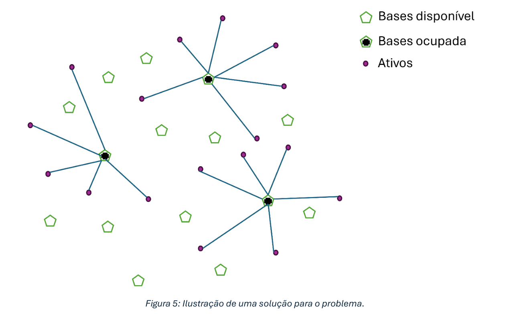

# O que se deseja conhecer
1. Bases onde serão alocadas as equipes de manutenção;
2. Os ativos sob responsabilidade de cada equipe.

# Restrições de projeto
1. Cada equipe deve ser alocada a exatamente uma base de manutenção;
2. Cada ativo deve ser atribuído a exatamente uma base de manutenção;
3. Cada ativo só pode ser atribuído a uma base se esta estiver ocupada por
pelo menos uma equipe de manutenção;
4. Cada ativo deve ser atribuído a exatamente uma equipe de manutenção;5. Cada ativo só pode ser atribuído a uma equipe se esta estiver ocupando a
base na qual o ativo estiver alocado;
6. Considerando a existência de 𝑛 ativos e 𝑚 bases, cada equipe deve ser
responsável por pelo menos 𝜂𝑛/𝑚, em que 𝜂 = 0.2 é um percentual definido
pela empresa.
---

## i. Formulação:
Assuma a seguinte definição das variáveis de otimização:
__________________________________________________________________
* 𝑥𝑖𝑗 ∈ {0,1}: 1 se o ativo i for atribuído à base j; 0, caso contrário;
* 𝑦𝑗𝑘 ∈ {0,1}: 1 se a base j for ocupada pela equipe k; 0, caso contrário;
* ℎ𝑖𝑘 ∈ {0,1}: 1 se o ativo i for mantido pela equipe k; 0, caso contrário.
__________________________________________________________________

(a) Modele uma função objetivo 𝑓1 (·) para minimização da distância total entre os
ativos e suas respectivas equipes de manutenção.

(b) Modele uma função objetivo 𝑓2 (·) para minimização da diferença do número de
ativos mantidos pelas equipes mais e menos sobrecarregadas.

(c) Modele as restrições do problema.

## ii. Algoritmo de solução:

(a) Proponha uma variação da metaheurística vista no curso que seja adequada
para resolver as versões mono-objetivo do problema (i.e., para otimizar
separadamente as funções 𝑓1 (·) e 𝑓2 (·) com suas respectivas restrições).

(b) Explicite como uma solução candidata será modelada computacionalmente.

(c) Proponha pelo menos três (03) estruturas de vizinhança.

(d) Proponha uma heurística construtiva para gerar a solução inicial.

(e) Considere alguma estratégia de refinamento (busca local).

## iii. Resultados da otimização mono-objetivo:
(a) Utilize o algoritmo proposto no item (ii) para resolver as versões mono-objetivo
do problema.

(b) Como o método é estocástico, ele deve ser executado 05 vezes para cada uma
das funções e os cinco resultados finais obtidos devem ser apresentados: para
cada função otimizada, mostre os valores min, std e max considerando-se as 05
soluções finais encontradas.

(c) Para cada função otimizada, apresente as 05 curvas de convergência do
algoritmo sobrepostas em uma mesma figura, i.e., evolução do valor de f(·) em
função do número de avaliações de soluções candidatas ou iterações do algoritmo
proposto.

(d) Para cada função otimizada, plote uma figura no plano Cartesiano com a melhor
solução encontrada, ilustrando a localização de todos os ativos e todas as bases
(destaque as bases ocupadas e as respectivas equipes alocadas). Estabeleça
conexões entre os ativos e as respectivas equipes de manutenção responsáveis.
Veja exemplo de ilustração na Figura 5.

---
# Modelo Matemático

## Conjuntos
* $I$: Ativos;
* $J$: Bases;
* $K$: Equipes.

## Variáveis de controle
* $𝑦_{𝑗𝑘}$ ∈ {0,1}: A base j será ocupada pela equipe k? 1 se sim, 0 se não.
* $ℎ_{𝑖𝑘}$ ∈ {0,1}: O ativo i está sob responsabilidade da equipe k?  1 se sim, 0 se não.

## Parâmetros
* $d_{ij}$ ∈ R: Distância entre o ativo $i$ e a base $j$.

## Funções objetivo
* minimização da distância total entre os ativos e suas respectivas equipes de manutenção.
$minimize \ f_1(\textbf{Y}, \textbf{H}) = \sum_{k \in K}\sum_{j \in J}\sum_{i \in I} y_{jk}h_{ik}d_{ij}$
  * a base j está ocupada pela equipe k ($y_{jk}=1$) e essa equipe atende o ativo i ($h_{ik}=1$).

* minimização da diferença do número de ativos mantidos pelas equipes mais e menos sobrecarregadas.
$minimize \ f_2(\textbf{H}) = max(\sum_{i \in I} h_{ik} \forall k \in K) - min(\sum_{i \in I} h_{ik} \forall k \in K)$

## Restrições

1. Cada equipe deve ser alocada a exatamente uma base de manutenção:
$\sum_{j \in J} y_{jk} = 1 \forall k \in K$

2. Cada ativo deve ser atribuído a exatamente uma base de manutenção:
$\sum_{j \in J} x_{ij} = 1 \forall i \in I$

3. Cada ativo só pode ser atribuído a uma base se esta estiver ocupada por
pelo menos uma equipe de manutenção:
$x_{ij} \leq y_{jk}\forall i \in I\forall j \in J\forall k \in K$

4. Cada ativo deve ser atribuído a exatamente uma equipe de manutenção:
$\sum_{i \in I} h_{ik} = 1 \forall i \in I$

5. Cada ativo só pode ser atribuído a uma equipe se esta estiver ocupando a
base na qual o ativo estiver alocado:
$h_{ik} \leq x_{ij}\forall i \in I\forall j \in J\forall k \in K$
